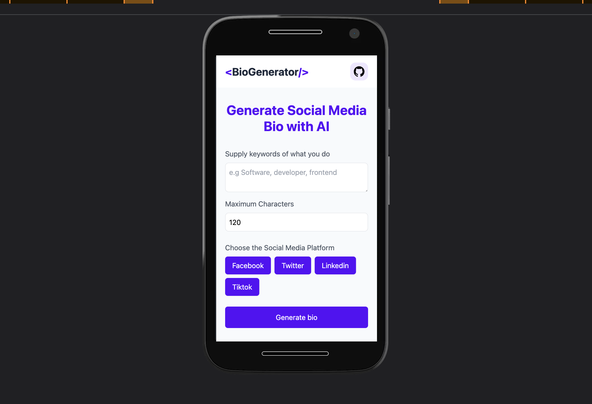

# Bio-Generator

This is built on top of OpenAi API to help generate bio by giving it a key words of what you do.



## Project Setup

```sh
npm install
```

generate your api key from openai and on the submit function in App.vue

### Compile and Hot-Reload for Development

```sh
npm run dev
```

### Type-Check, Compile and Minify for Production

```sh
npm run build
```

### Lint with [ESLint](https://eslint.org/)

```sh
npm run lint
```
